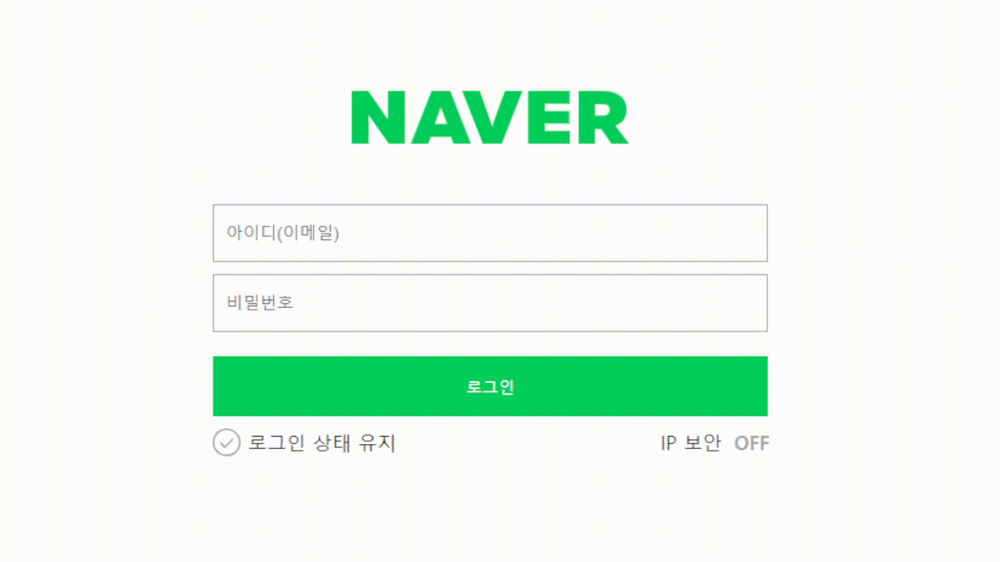
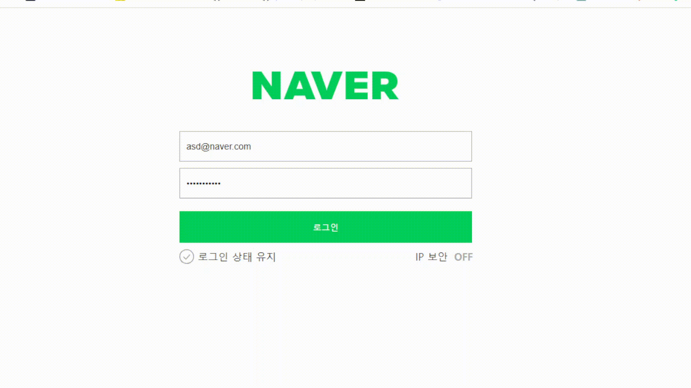

# 네이버 로그인 페이지 구현

로그인과 비밀번호를 정확히 입력했을 때 welcome 페이지로 넘어갈 수 있도록 코드 로직을 작성합니다.
- [x] 재사용 가능한 함수를 분리하고 함수를 중심으로 설계하는 방법에 대해 학습합니다.

### 상황1. 이메일 형식으로 제대로 칠 때까지 에러메세지가 보입니다.

### 상황2. 알맞은 형식의 비밀번호를 칠 때까지 에러메세지가 보입니다.

### 상황3. 입력값이 없을 시 에러메세지가 안보입니다.

### 상황4. 아이디와 비밀번호가 맞지 않을 시 경고창이 뜨고 welcome.html로 넘어갈 수 없습니다.

### 상황5. 아이디와 비밀번호가 일치하면 welcome.html로 넘어갈 수 있습니다.

